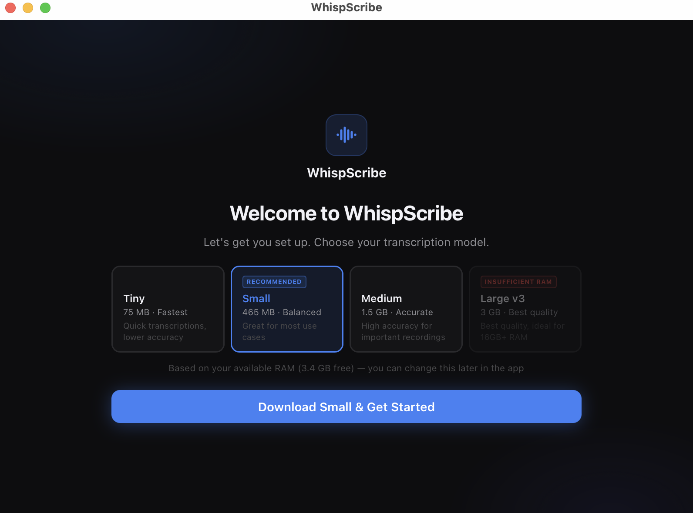
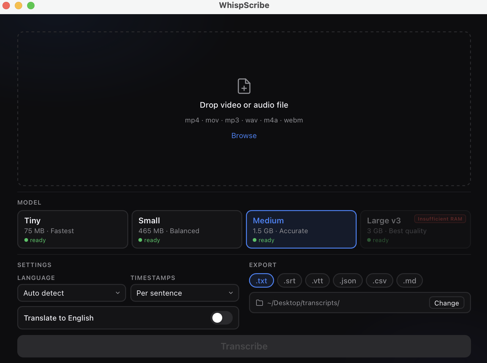

<p align="center">
  
</p>

<p align="center">
  <strong>WhispScribe</strong>
  <br>
  Free, open source local audio and video transcription powered by OpenAI Whisper.
  <br>No cloud. No subscription. Nothing leaves your machine.
</p>

<p align="center">
  
  
  
  
</p>

<hr>

<p align="center">
  
  <br><br>
  
</p>

---

## Features

* Drag and drop mp4, mov, mp3, wav, m4a, and webm files
* Fully local transcription with nothing leaving your machine
* Automatic hardware detection that recommends the best model for your available RAM
* GPU accelerated on Apple Silicon via Metal
* Export to .txt, .srt, .vtt, .json, .csv, and .md
* 99 language support
* Works on macOS and Windows

---

## Download

Releases will be available on the [GitHub releases page](../../releases).

---

## Installation

### macOS

After downloading the .dmg file, drag WhispScribe to your Applications folder.

Because WhispScribe is not yet notarized with Apple, macOS may block it from opening. To fix this, run the following command in Terminal after installing:

```bash
xattr -cr /Applications/WhispScribe.app
```

Then open the app normally. You only need to do this once.

Alternatively, right click the app and select Open, then click Open in the dialog that appears.

### Windows

Run the installer and follow the setup wizard. Windows may show a SmartScreen warning for unsigned apps. Click More info then Run anyway to proceed.

---

## Supported Models

| Model    | Size   | RAM Required | Speed        |
|----------|--------|--------------|--------------|
| Tiny     | 75 MB  | 1 GB         | Fastest      |
| Small    | 465 MB | 1.5 GB       | Fast         |
| Medium   | 1.5 GB | 2.5 GB       | Accurate     |
| Large v3 | 3 GB   | 5 GB         | Best quality |

Models are downloaded on first launch and cached locally. They are never bundled in the app itself.

---

## Building from Source

**Requirements:** Node.js 18+, Rust, Cargo

```bash
git clone https://github.com/rotnn/whispscribe
cd whispscribe
npm install
npm run tauri dev
```

> **Note:** ffmpeg binaries are not included in the repository due to their size. Download them separately before building and see [src-tauri/resources/README.md](src-tauri/resources/README.md) for instructions.

---

## License

MIT
